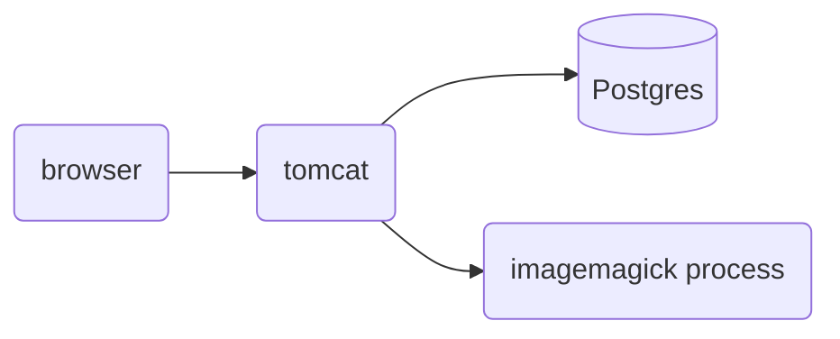

# poipiku
ポイピクサーバのリポジトリです。このほかにバッチ処理の一部と、アプリ版は別リポジトリにあります。

## 主要なディレクトリ
・・・

## ローカルでの開発環境
### 構成

### ポイント
- tomcatにオレオレ証明書を仕込みます。
- poipiku.comをlocalhostに向けます。
- 画像は別ドメイン。
- 全文検索にgroongaを用います。groongaをインストールしてpgroongaをpostgresのextentionに追加すると利用可能です。なくても他の機能に影響ありません。

## 表示別バージョン
以下の２つの軸でViewを出し分けています。
- 画面サイズによる分け方：　PC版 vs スマホ版
- クライアントのプラットフォームによる分け方： アプリ版 vs ブラウザ版

アプリ版はスマホサイズにしか対応していません。ブラウザ版は、デバイスによりPC版・スマホ版の２通りがあります。

つまり、実際のところは、
1. スマホブラウザ版
2. スマホPC版
3. アプリ版
の３通りとなります。

## コーディング規則
ハンガリアン記法の名残が残っていますが、**揃える必要はありません**。
影響範囲が狭そうな箇所は適宜リファクタリングしますが、ケースバイケースで対応しています。

