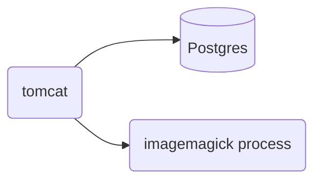

# poipiku
ポイピクサーバサイドのリポジトリです。バッチ処理の一部と、アプリ版は別リポジトリにあります。

## ローカルでの開発環境
### 構成

### ポイント
- tomcatにオレオレ証明書を仕込みます。
- poipiku.comをlocalhostに向けます。
- 画像は別ドメイン
- 全文検索にgroongaを用います。groongaをインストールしてpgroongaをpostgresのextentionに追加すると利用可能です。なくても他の機能に影響ありません。
